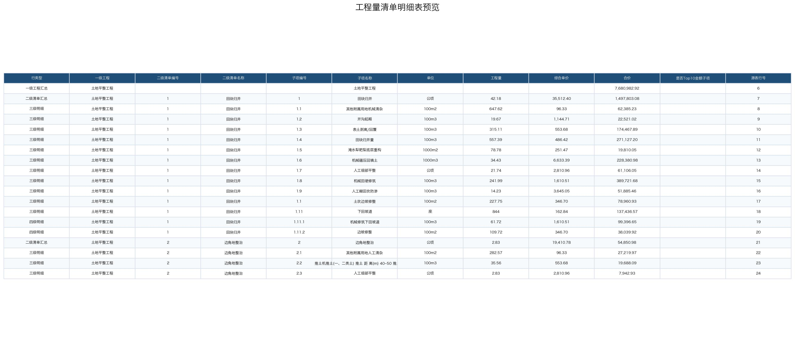
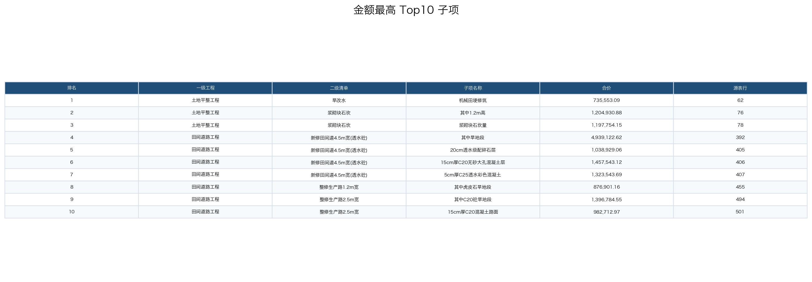

# BOQ Cleanup Lightweight Eval

> 日期：2026-06-24  
> Run ID：`boq-cleanup-20260624-143239`  
> Session：`cli:boq-cleanup-20260624-143239`  
> 模型：`deepseek-v4-pro` via DashScope OpenAI-compatible  
> 输入：`workspace/uploads/工程量清单.xlsx`

## 1. 任务

将层级较乱的工程量清单整理成可直接筛选分析的明细表：补齐一级工程、二级清单、子项关系，区分汇总行与真正明细行，并标记金额最高的 10 个子项。

完整 prompt：

- [prompt.txt](artifacts/boq-cleanup-20260624-143239/logs/prompt.txt)

## 2. 运行结果

| 指标 | 值 |
| --- | ---: |
| LLM judge | 92/100 (pass) |
| 总耗时 | 353.5 秒 |
| total tokens | 551,109 |
| prompt tokens | 530,672 |
| completion tokens | 20,437 |
| cached tokens | 386,048 |
| 工具调用数 | 13 |

Judge 理由：整体清洗质量高，层级、字段、Top10和可用性均满足要求，仅少量需人工复核的边界情况。

## 3. 输出产物

- [工程量清单.xlsx](artifacts/boq-cleanup-20260624-143239/inputs/工程量清单.xlsx)
- [工程量清单_明细表.xlsx](artifacts/boq-cleanup-20260624-143239/outputs/工程量清单_明细表.xlsx)
- [final_assistant_response.md](artifacts/boq-cleanup-20260624-143239/logs/final_assistant_response.md)
- [usage.json](artifacts/boq-cleanup-20260624-143239/logs/usage.json)
- [judge.json](artifacts/boq-cleanup-20260624-143239/logs/judge.json)
- [workbook_summary.json](artifacts/boq-cleanup-20260624-143239/logs/workbook_summary.json)

## 4. Workbook 摘要

- `工程量清单明细表`：524 行 x 12 列，非空单元格 5746，公式 0，图表 0。
- `说明`：34 行 x 2 列，非空单元格 57，公式 0，图表 0。

行类型分布：

- 一级工程汇总: 4
- 二级清单汇总: 55
- 三级明细: 319
- 四级明细: 144
- 总计: 1

预览：

## 5. Top10 子项

- #1 机械田埂修筑 | 土地平整工程 / 旱改水 | 合价=735553.0935 | 源表行=62
- #2 其中1.2m高 | 土地平整工程 / 浆砌块石坎 | 合价=1204930.8843 | 源表行=76
- #3 浆砌块石坎量 | 土地平整工程 / 浆砌块石坎 | 合价=1197754.1514 | 源表行=78
- #4 其中旱地段 | 田间道路工程 / 新修田间道4.5m宽(透水砼) | 合价=4939122.6199 | 源表行=392
- #5 20cm透水级配碎石层 | 田间道路工程 / 新修田间道4.5m宽(透水砼) | 合价=1038929.0563 | 源表行=405
- #6 15cm厚C20无砂大孔混凝土层 | 田间道路工程 / 新修田间道4.5m宽(透水砼) | 合价=1457543.1186 | 源表行=406
- #7 5cm厚C25透水彩色混凝土 | 田间道路工程 / 新修田间道4.5m宽(透水砼) | 合价=1323543.6876 | 源表行=407
- #8 其中虎皮石旱地段 | 田间道路工程 / 整修生产路1.2m宽 | 合价=876901.156 | 源表行=455
- #9 其中C20砼旱地段 | 田间道路工程 / 整修生产路2.5m宽 | 合价=1396784.5501 | 源表行=494
- #10 15cm厚C20混凝土路面 | 田间道路工程 / 整修生产路2.5m宽 | 合价=982712.9693 | 源表行=501

## 6. 简短判断

可靠完成：层级补齐、行类型区分、可筛选字段、Top10 标记和源表行号追溯。

主要边界：部分重复明细未自动去重；三级明细下还有四级子项时，金额口径可能存在重复合计风险，后续可增加“是否叶子明细/是否可计入测算”字段。

Judge 记录：

- 优点：层级识别准确，区分了一级工程、二级清单、三级和四级明细及汇总行
- 优点：上下文补齐逻辑清晰，跨子表关联处理得当
- 优点：输出Excel可直接筛选分析，字段设计完整且包含源表行号可追溯
- 优点：Top10金额子项标记正确，并附有具体金额和名称
- 优点：清洗逻辑、字段设计和人工复核点说明详细
- 问题：部分重复明细项未自动去重，需人工核实
- 问题：三级明细含子项时可能引起重复合计风险，未在表中做特殊标记
