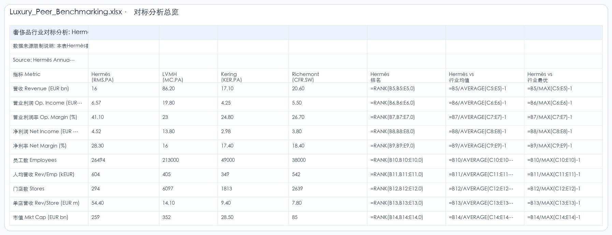
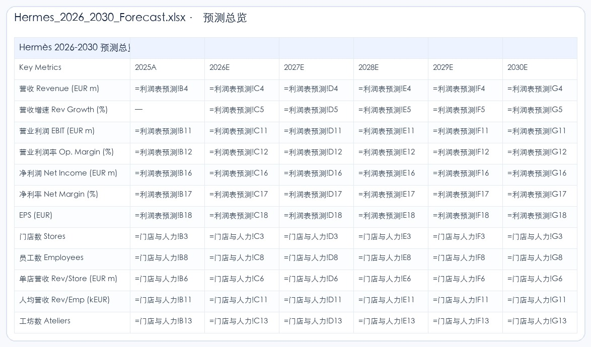

# Hermes Anthropic XLSX Skill Eval

> 日期：2026-06-22  
> Run ID：`hermes-anthropic-xlsx-20260622`  
> Session：`cli:hermes-anthropic-20260622-155512`  
> 模型：`deepseek-v4-pro` via DashScope OpenAI-compatible  
> 配置：`nanobot/configs/tableclaw-bailian-dashscope-anthropic-xlsx-only.json`  
> 输入：`workspace/uploads/Hermes_20Year_Panorama_2006_2025.xlsx`

## 1. 评测目的

这条 run 用来评估 TableClaw 在“非四川财资业务场景”下的通用 table workflow 能力。

核心问题不是“业务 domain knowledge 是否拟合”，而是：

- 模型能否识别这是通用 spreadsheet/workbook 任务。
- 模型是否会选择并读取 `anthropic-xlsx`。
- 在通用 spreadsheet skill 可见性设计下，模型能否完成复杂 workbook artifact 任务。
- 是否能记录完整 tool trace、skill 选择、耗时、token、产物和验证结果。

本次评测不是自动打分 benchmark，而是 artifact smoke / workflow trace：重点观察复杂 workbook 任务能否被拆解、执行、验证和归档。

## 2. 用户任务

原始任务包含三部分：

1. 对 `Sheet1` 的 5157 行日频数据进行标准化整理：拆分日期、股价、市值、营收等核心字段，去除空列与无效行，规范统一表头，解决原表格表头错位、空列过多的问题。
2. 基于原表格的爱马仕数据，补充 LV 等同赛道头部企业的同周期经营数据，搭建多公司对标分析表，计算核心指标的对标差异、行业排名、增长差距，实现横向对标对比。
3. 基于 20 年历史经营数据，构建爱马仕 2026-2030 年未来 5 年财务预测模型，覆盖营收、成本、利润、门店扩张等核心维度。

## 3. Skill / Tool 可见性设计

本评测线的目标是通用 table artifact task。当前 nanobot 骨架中，表格相关 builtin skill 已收敛为：

- `anthropic-xlsx`

这意味着模型在复杂 workbook 清洗、重构、建模和 `.xlsx` 交付任务上，主要依赖一个完整的 spreadsheet skill，而不是在多个碎片化表格 skill 之间做选择。

这次 Hermes run 的实际 trace 显示，模型第一步就读取了 `anthropic-xlsx`：

```text
Reading the anthropic-xlsx skill
↳ read …/skills/anthropic-xlsx/SKILL.md
```

## 4. 运行统计

Usage 记录：

```json
{
  "latency_ms": 695007,
  "model": "deepseek-v4-pro",
  "provider": "OpenAICompatProvider",
  "session_key": "cli:hermes-anthropic-20260622-155512",
  "stop_reason": "completed",
  "tools_used": [
    "read_file",
    "tableclaw_inspect",
    "read_file",
    "exec",
    "exec",
    "exec",
    "exec",
    "exec",
    "exec",
    "exec",
    "exec",
    "exec",
    "write_file",
    "exec",
    "exec",
    "exec"
  ],
  "usage": {
    "cached_tokens": 356352,
    "completion_tokens": 40034,
    "prompt_tokens": 622777,
    "total_tokens": 662811
  }
}
```

| 指标 | 数值 |
| --- | ---: |
| 总耗时 | 695.007 秒 |
| 总 token | 662,811 |
| Prompt token | 622,777 |
| Completion token | 40,034 |
| Cached token | 356,352 |
| 工具调用数 | 16 |
| 结束状态 | completed |

## 5. DeepSeek-V4-Pro 最终回复

最终面向用户的回复已从 session `cli:hermes-anthropic-20260622-155512` 抽取并归档：

- [final_assistant_response.md](artifacts/hermes-anthropic-xlsx-20260622/logs/final_assistant_response.md)

核心内容如下：

```markdown
## 任务完成总结

### 使用的 Skill
**anthropic-xlsx** — 读取了 `/skills/anthropic-xlsx/SKILL.md`，用于指导 Excel 文件的读取、结构化、公式化、样式化输出。

### 调用的工具链

| 步骤 | 工具 | 用途 |
|------|------|------|
| 1 | `read_file` | 读取 anthropic-xlsx skill |
| 2 | `tableclaw_inspect` | 快速扫描表结构（5157行×20列，含合并单元格） |
| 3 | `exec` (python/openpyxl) ×4 | 探索原始数据布局、发现5个数据段 |
| 4 | `exec` (python/openpyxl) ×3 | 构建3个输出文件 |
| 5 | `exec` (python) | 验证3个输出文件结构和数据完整性 |

### 关键中间判断

1. 原始表实际是 5 个独立数据段堆叠在 Sheet1 中（日频股价 / 年度经营 / 关键事件），且 F-T 列在日频段为空，年频段 F-M 列有数据。
2. 按数据段拆分为 5 个独立 Sheet（日频股价数据、年度经营数据、关键事件、结构演进、概览KPI）。
3. LVMH 日频股价已存在于原表中，但 Kering/Richemont 的财务数据无法联网获取；采用公开财报估算值 + 黄色底色 + `†` 标记 + 独立“数据来源与假设”Sheet。
4. 预测模型通过跨 Sheet 引用连接到可调整假设面板，修改蓝色输入单元格即可自动重算。
```

最终回复给出了 3 个输出文件的功能说明，并明确说明 `Luxury_Peer_Benchmarking.xlsx` 中 LVMH/Kering/Richemont 的 FY2025 经营数据无法通过实时 API 获取，已在 workbook 中以 `†` 和黄色底色标注为估算值。

## 6. 工具轨迹

| 阶段 | 工具 / 动作 | 作用 |
| --- | --- | --- |
| 1 | `read_file` | 读取 `anthropic-xlsx/SKILL.md`，建立 spreadsheet artifact 任务策略。 |
| 2 | `tableclaw_inspect` | 快速扫描原始 workbook：5157 行、20 列、2 个 sheet、合并单元格。 |
| 3 | `read_file` | 读取完整 inspect 结果。 |
| 4 | `exec (python/openpyxl)` | 探索前 50 行，发现实际 sheet 名不是 `Sheet1`，而是 `Sheet1 · 长周期增长主线`。 |
| 5 | `exec (python/openpyxl)` | 重新探索真实 sheet，识别日频、年频、关键事件等堆叠结构。 |
| 6 | `exec (python/openpyxl)` | 探索 `Sheet2 · 结构演进`，识别品类/地区/门店/利润率结构数据。 |
| 7 | `exec (python/openpyxl)` | 生成清洗标准化 workbook。 |
| 8 | `exec (python/openpyxl)` | 生成奢侈品同行对标 workbook。 |
| 9 | `exec (python/openpyxl)` | 首次生成预测模型，因长 heredoc / 参数格式问题失败。 |
| 10 | `write_file` | 将预测模型脚本写入 `build_forecast.py`，避免 heredoc 截断。 |
| 11 | `exec (python)` | 执行 `build_forecast.py`，生成预测模型 workbook。 |
| 12 | `exec (python)` | 验证 3 个输出文件结构、sheet、公式数量和关键预测值。 |
| 13 | `exec rm` | 删除临时脚本。 |

完整日志：

- [run_cli_output.txt](artifacts/hermes-anthropic-xlsx-20260622/logs/run_cli_output.txt)
- [final_assistant_response.md](artifacts/hermes-anthropic-xlsx-20260622/logs/final_assistant_response.md)
- [usage.json](artifacts/hermes-anthropic-xlsx-20260622/logs/usage.json)
- [tool result 1](artifacts/hermes-anthropic-xlsx-20260622/tool-results/call_b8ab9b4d60f8494293bab51e.txt)
- [tool result 2](artifacts/hermes-anthropic-xlsx-20260622/tool-results/call_6ac31c9bbb9842b59757b561.txt)

## 7. 关键中间判断

模型没有把原始 workbook 当成一个扁平表，而是识别为多段堆叠结构：

- `Sheet1 · 长周期增长主线`
  - Rows 1-9：标题、摘要指标和来源说明。
  - Rows 10-5120：日频股价数据，约 5110 行。
  - Row 5121：空分隔行。
  - Rows 5122-5142：年度经营数据，2006-2025。
  - Rows 5145-5157：关键事件。
- `Sheet2 · 结构演进`
  - 品类收入结构。
  - 地区收入结构。
  - 门店 / 人效 / 利润率结构。

重要恢复点：

- 用户说 `Sheet1`，但实际 sheet 名是 `Sheet1 · 长周期增长主线`，模型通过 openpyxl 探索纠正。
- 原始 `Sheet1` 包含多个逻辑表和大量空列，模型将其拆成多个语义 sheet。
- 预测模型首次长脚本执行失败后，模型改为写入脚本文件再执行，恢复成功。
- 对标任务中，原表只包含 Hermès 和 LVMH 股价，不包含完整 Kering / Richemont 经营数据；模型在输出中将外部 peer 数据标为估算，并提供假设说明。

## 8. 输出产物

### 8.1 清洗标准化 Workbook

文件：

- [Hermes_Cleaned_Standardized.xlsx](artifacts/hermes-anthropic-xlsx-20260622/outputs/Hermes_Cleaned_Standardized.xlsx)

预览：


结构：

| Sheet | 行数 | 列数 | 非空单元格 | 公式数 |
| --- | ---: | ---: | ---: | ---: |
| 日频股价数据 | 5113 | 4 | 20,446 | 0 |
| 年度经营数据 | 24 | 12 | 256 | 99 |
| 关键事件 | 12 | 4 | 45 | 0 |
| 结构演进 | 53 | 9 | 230 | 0 |
| 概览KPI | 13 | 2 | 25 | 0 |

评估：

- 完成原始堆叠表拆分。
- 去除日频段 F-T 空列。
- 将年频经营数据从错位区域重构为规范表。
- 保留结构演进与关键事件信息。

### 8.2 奢侈品同行对标 Workbook

文件：

- [Luxury_Peer_Benchmarking.xlsx](artifacts/hermes-anthropic-xlsx-20260622/outputs/Luxury_Peer_Benchmarking.xlsx)

预览：



结构：

| Sheet | 行数 | 列数 | 非空单元格 | 公式数 |
| --- | ---: | ---: | ---: | ---: |
| 对标分析总览 | 16 | 8 | 107 | 36 |
| 营收增长对比 | 17 | 6 | 62 | 17 |
| 利润率对比 | 9 | 6 | 44 | 6 |
| 估值对比 | 9 | 6 | 44 | 6 |
| 数据来源与假设 | 26 | 2 | 38 | 0 |

评估：

- 搭建 Hermès / LVMH / Kering / Richemont 横向对标框架。
- 计算 rank、premium/discount、growth gap、margin gap、valuation gap。
- 对非源表数据做估算标记和来源假设说明。
- 后续若接入外部财报/RAG，应替换估算 peer data。

### 8.3 2026-2030 预测模型 Workbook

文件：

- [Hermes_2026_2030_Forecast.xlsx](artifacts/hermes-anthropic-xlsx-20260622/outputs/Hermes_2026_2030_Forecast.xlsx)

预览：



结构：

| Sheet | 行数 | 列数 | 非空单元格 | 公式数 |
| --- | ---: | ---: | ---: | ---: |
| 假设面板 | 29 | 3 | 58 | 5 |
| 利润表预测 | 19 | 7 | 120 | 79 |
| 门店与人力 | 14 | 7 | 72 | 50 |
| 预测总览 | 16 | 7 | 96 | 73 |
| 情景分析 | 12 | 4 | 42 | 0 |

评估：

- 构建 2025A-2030E 模型。
- 使用假设面板驱动，而不是只输出 Python 计算值。
- 覆盖收入、成本、经营利润、净利润、门店、人效和情景分析。
- 公式数量较多，说明模型具备可调参和可审计基础。

## 9. LV / LVMH 对标数据来源核验

用户问题中提到“补充 LV 等同赛道头部企业的同周期经营数据”。本次 run 中的实际处理应拆成两类：

| 数据类型 | 是否来自原表 | 是否联网获取 | 本次处理 |
| --- | --- | --- | --- |
| LVMH 日频股价 `LVMH (EUR)` / `MC.PA` | 是 | 否 | 来自原 workbook `Sheet1 · 长周期增长主线` 的日频段，已写入 `Hermes_Cleaned_Standardized.xlsx`。 |
| LVMH FY2025 营收、利润、员工、门店、市值、估值倍数 | 否 | 否 | DeepSeek-V4-Pro 在生成 `Luxury_Peer_Benchmarking.xlsx` 时写入估算值，并在 workbook 中以 `†`、黄色底色和“数据来源与假设”Sheet 标注。 |
| Kering / Richemont 经营与估值数据 | 否 | 否 | 同样是估算值，不是自动召回或实时校验数据。 |

关键结论：

- 本轮 trace 中没有 `web_search`、browser、联网检索或外部财报下载工具调用。
- 原始 workbook 本身包含 Hermès 年度经营数据和 LVMH 日频股价数据；不包含 LV/LVMH 完整同周期经营财务指标。
- `Luxury_Peer_Benchmarking.xlsx` 的 peer operating metrics 是模型根据公开常识/估算口径搭建的分析框架，而不是已验证事实数据库。
- 因此，本次对标产物适合作为“结构化框架 smoke 成功”，不适合作为“同行财务数据准确性已验证”的结论。

对应 workbook 已在以下位置明确标注：

- `对标分析总览!A2:A3`：说明 LVMH/Kering/Richemont 数据为公开财报摘要及行业估算，非实时 API 数据。
- `数据来源与假设` Sheet：逐项列出 LVMH、Kering、Richemont 的估算说明。

后续若要把该任务升级为正式 eval，需要接入外部财报/RAG/联网数据源，并增加 peer data source citation 校验。

## 10. 结果判断

本次 run 判定为：**有条件通过通用 workbook artifact smoke v0**。

这里的“通过”只针对 workflow 和 artifact 结构，不等价于同行数据事实完全正确。

可靠完成的部分：

- **复杂源表结构恢复成功。** 模型没有把 `Sheet1 · 长周期增长主线` 当成扁平表，而是识别出日频股价、年度经营、关键事件三段堆叠结构，并把 `Sheet2 · 结构演进` 的品类、地区、门店和利润率数据纳入清洗产物。这说明 `anthropic-xlsx + openpyxl` 路线能够处理“一个 sheet 内多张逻辑表”的非标准 workbook。
- **产物不是简单自然语言摘要，而是可打开的 workbook artifact。** 三个输出文件分别承担清洗标准化、同行对标和 2026-2030 预测模型职责；其中 `Hermes_Cleaned_Standardized.xlsx` 有 5 个语义 sheet，`Luxury_Peer_Benchmarking.xlsx` 有 5 个分析/假设 sheet，`Hermes_2026_2030_Forecast.xlsx` 有 5 个预测相关 sheet。
- **公式化建模能力成立。** 三个 workbook 合计包含多处公式：清洗标准化表的年度经营数据 99 个公式、同行对标表 65 个公式、预测模型 207 个公式。预测模型还把假设面板与利润表、门店人力、预测总览通过跨 sheet 公式连接起来，优于只输出静态数值。
- **错误恢复路径有效。** 首次长脚本执行失败后，模型改为写入 `build_forecast.py` 再执行，说明工具执行失败时可以从 heredoc/参数问题恢复到脚本文件方式。
- **不确定数据有显式标注。** 对于 LVMH/Kering/Richemont 的经营和估值数据，模型没有调用联网或 RAG，也无法从源表直接获得完整指标；最终 workbook 用 `†`、黄色底色和“数据来源与假设”Sheet 标注为估算值。这一点避免了把估算数据伪装成已验证事实。

主要边界：

- **同行对标任务只完成了框架，不完成事实校验。** 用户要求“补充 LV 等同赛道头部企业同周期经营数据”，但 trace 中没有 `web_search`、browser、外部财报下载或结构化数据源调用。原表只含 Hermès 经营数据和 LVMH 日频股价，不含 LVMH/Kering/Richemont 完整年度经营指标。因此 `Luxury_Peer_Benchmarking.xlsx` 适合作为分析框架 smoke，不应作为可直接交付的事实型同行研究。
- **没有图表或 dashboard 级产物。** 这条任务没有明确要求图表，但“对标分析”和“预测模型”后续如果面向展示，仍需要 chart/dashboard sheet；本次 3 个 workbook 的 openpyxl chart count 均为 0。
- **验证停留在结构层。** 当前归档只证明文件存在、sheet/公式数量合理、openpyxl 可读；没有 LibreOffice 重算、公式错误扫描、关键单元格断言、全 sheet render 检查，也没有人工打开 Excel/WPS 的视觉 QA。
- **成本很高。** 本次耗时约 695 秒、662,811 tokens。对单个高价值 workbook artifact 可以接受，但不能作为高频表格 QA 的默认路径。

## 11. 后续改进

基于这条 trace，下一轮应优先补以下能力：

- **External data contract。** 对“补充同行公司数据”这类任务，先判断源表是否包含所需同行经营指标；若缺失，必须进入外部数据/RAG/人工上传数据路径。产物中每个 peer metric 应有 `source_type`（源表/外部财报/估算）、source citation、更新时间和可信度标记。没有来源时只能生成分析模板，不应填充看似确定的数值。
- **Artifact checker for formula models。** 针对预测模型自动检查：关键 sheet 是否存在、假设单元格是否被公式引用、预测期是否覆盖 2026-2030、核心公式是否跨 sheet 引用假设面板、是否出现 `#REF!/#VALUE!/#DIV/0!` 等错误。
- **Workbook render / recalc QA。** 增加 LibreOffice 或 WPS headless 打开、重算、保存和截图流程；没有重算环境时，报告应明确标记为“结构验证通过，公式运行结果未验证”。
- **Section detector 工具化。** Hermes 的核心难点是一个 sheet 中堆叠多个逻辑表。应把“空行分隔、标题行、重复表头、数据段范围、单位/来源说明”的检测固化成 `tableclaw_inspect` 或 catalog profile，而不是每次让模型临时写 openpyxl 探索脚本。
- **脚本执行规范。** 复杂 workbook 任务应默认使用单个可复现 builder 脚本，并把脚本、输入摘要、输出 manifest 一并归档；长 heredoc 只适合短探测，不适合作为正式 artifact 生成方式。
- **成本控制。** 对 workbook artifact 任务采用“两阶段上下文”：第一阶段只生成 schema/section summary 和执行计划，第二阶段根据计划执行脚本，减少多次读取大 tool result 和重复解释源表结构。
