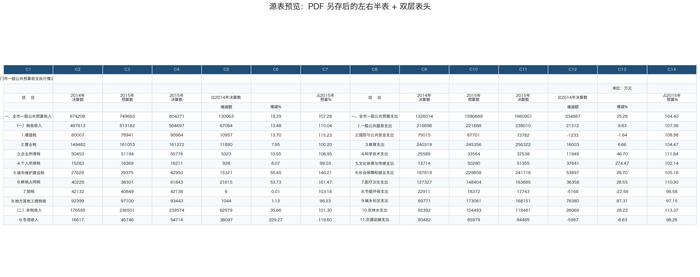
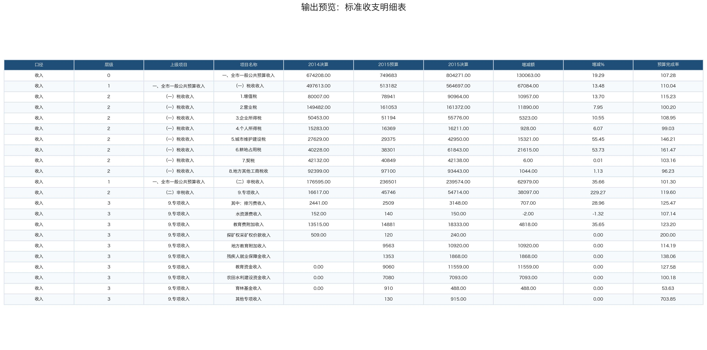
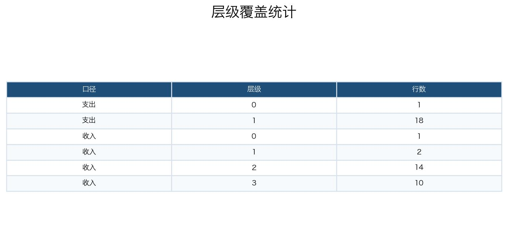

# Jingmen Budget XLS Cleanup Eval

> 日期：2026-06-24  
> Run ID：`jingmen-budget-xls-20260624-135419`  
> Session：`cli:jingmen-budget-xls-20260624-135419`  
> 模型：`deepseek-v4-pro` via DashScope OpenAI-compatible  
> 配置：`nanobot/configs/tableclaw-bailian-dashscope.json`  
> 输入：`workspace/uploads/2015年荆门市一般公共预算收支执行情况表（表一）.xls`

## 1. 评测目的

这条 run 用来评估 TableClaw 在“PDF 另存 Excel / 老 `.xls` / 左右半表 / 双层表头”这类政府公开表格上的通用清洗能力。

核心观察点：

- 模型是否能识别这是通用 spreadsheet 清洗任务，并读取 `anthropic-xlsx`。
- 能否处理 `.xls` 旧格式，以及 `tableclaw_inspect` 不支持 `.xls` 时的恢复路径。
- 能否识别左右两半、收入/支出两套表头、标题行、单位行、脚注、空行和无效行。
- 能否把源表整理为标准明细表，并保留收入、支出、层级和关键数值字段。
- 是否能记录 tool trace、token、耗时、最终回复和输出 workbook。

本次评测是 artifact smoke / workflow trace，不是自动 ACC/F1 benchmark。

## 2. 用户任务

用户要求处理一页从政府决算 PDF 另存出来的 Excel：

1. 源表左右各一半，表头是两层，不便分析。
2. 整理成一张标准明细表，收入和支出都要保留。
3. 字段至少包含：口径、项目名称、2014决算、2015预算、2015决算、增减额、增减%、预算完成率。
4. 帮忙设计字段，并理出层级。
5. 最终交付一个干净的 Excel 表。

完整 prompt：

- [prompt.txt](artifacts/jingmen-budget-xls-20260624/logs/prompt.txt)

## 3. Skill / Tool 可见性设计

本次按默认真实用户配置运行：

```text
nanobot/configs/tableclaw-bailian-dashscope.json
```

实际 trace 显示，模型第一步读取了 `anthropic-xlsx`，并尝试调用 `tableclaw_inspect`：

```text
read_file("…/skills/anthropic-xlsx/SKILL.md")
tableclaw_inspect("…/workspace/uploads/2015年荆门市一般公共预算收支执行情况表（表一）.xls")
```

关键现象：

- `anthropic-xlsx` 成功触发。
- `tableclaw_inspect` 返回 `Unsupported table file extension: .xls`。
- 模型没有终止，而是降级到 `pandas.ExcelFile` / `pd.read_excel` 直接读取 `.xls`，继续完成结构分析和产物生成。

这说明通用 spreadsheet skill 的任务路由有效，但 TableClaw 原生 inspect 工具还需要补 `.xls` 支持。

## 4. 运行统计

Usage 记录：

```json
{
  "run_id": "jingmen-budget-xls-20260624-135419",
  "session": "cli:jingmen-budget-xls-20260624-135419",
  "elapsed_ms": 176282,
  "usage": {
    "prompt_tokens": 225900,
    "completion_tokens": 9463,
    "total_tokens": 235363,
    "cached_tokens": 176640
  },
  "tools_used": [
    "read_file",
    "tableclaw_inspect",
    "exec",
    "exec",
    "exec",
    "exec",
    "exec",
    "exec",
    "exec"
  ]
}
```

汇总：

| 指标 | 值 |
| --- | ---: |
| 总耗时 | 176.3 秒 |
| 总 token | 235,363 |
| prompt tokens | 225,900 |
| completion tokens | 9,463 |
| cached tokens | 176,640 |
| 工具调用数 | 9 |
| 结束状态 | completed |

## 5. DeepSeek-V4-Pro 最终回复

最终面向用户的回复已从 session `cli:jingmen-budget-xls-20260624-135419` 抽取并归档：

- [final_assistant_response.md](artifacts/jingmen-budget-xls-20260624/logs/final_assistant_response.md)

最终回复核心内容：

- 输出文件路径：`workspace/2015年荆门市一般公共预算收支明细表.xlsx`。
- 识别源表是 `.xls`，左半为收入，右半为支出。
- 将左右两半统一解析为一套字段：`口径 / 层级 / 上级项目 / 项目名称 / 2014决算 / 2015预算 / 2015决算 / 增减额 / 增减% / 预算完成率`。
- 通过前导空格、编号前缀和上下文连续块识别层级。
- 输出 46 行标准明细，其中收入 27 行、支出 19 行。
- 标注了 4 个需要人工复核的源表异常或语义边界。

## 6. 工具轨迹

| 阶段 | 工具 / 动作 | 作用 |
| --- | --- | --- |
| 1 | `read_file` | 读取 `anthropic-xlsx/SKILL.md`，建立 spreadsheet 清洗任务策略。 |
| 2 | `tableclaw_inspect` | 尝试 inspect `.xls`，返回不支持扩展名。 |
| 3 | `exec (pandas.ExcelFile)` | 读取 `.xls` sheet name、shape 和前 30 行，确认源表是 34 行 × 14 列。 |
| 4 | `exec (pandas)` | 查看源表下半部分和尾部脚注，定位无效行和说明行。 |
| 5 | `exec (pandas/openpyxl)` | 第一次写解析脚本，按左右半表抽取收入/支出字段。 |
| 6 | `exec (pandas)` | 复核收入项目名称前导空格和专项收入子项。 |
| 7 | `exec (openpyxl)` | 生成标准化输出 workbook。 |
| 8 | `exec (openpyxl)` | 修正解析逻辑后重新生成，确认层级和父级项目。 |
| 9 | `exec (pandas)` | 读取输出 workbook，验证 46 行、10 列、收入/支出和层级分布。 |

完整日志：

- [run_cli_output.txt](artifacts/jingmen-budget-xls-20260624/logs/run_cli_output.txt)
- [session.jsonl](artifacts/jingmen-budget-xls-20260624/logs/session.jsonl)
- [usage.json](artifacts/jingmen-budget-xls-20260624/logs/usage.json)
- [workbook_summary.json](artifacts/jingmen-budget-xls-20260624/logs/workbook_summary.json)

## 7. 关键中间判断

模型识别到的原始结构：

- 文件是旧 Excel `.xls`，sheet 名为 `2015年全市一般预算`。
- 源表尺寸为 34 行 × 14 列。
- 第 0 行是标题，第 1 行包含单位信息，第 2-3 行是双层表头。
- 左半 A-G 列是收入，右半 H-N 列是支出。
- 两侧都有相同的指标列：项目、2014决算、2015预算、2015决算、增减额、增减%、预算完成率。
- 第 32-33 行是说明脚注，不应进入明细表。
- 支出右半在收入行结束后出现大量空/零占位，应跳过。

重要恢复点：

- `tableclaw_inspect` 不支持 `.xls` 后，模型改用 pandas 读取，而不是要求用户转换文件。
- 第一次解析后，模型复核了专项收入子项，发现部分子项没有编号和前导空格，于是用“位于 `9.专项收入` 后的连续块”识别为 L3 子项。
- 输出前再次读取生成文件，验证列名、行数、口径分布和层级分布。

## 8. 输出产物

### 8.1 输出 Workbook

文件：

- [2015年荆门市一般公共预算收支明细表.xlsx](artifacts/jingmen-budget-xls-20260624/outputs/2015年荆门市一般公共预算收支明细表.xlsx)

输入源文件归档：

- [2015年荆门市一般公共预算收支执行情况表（表一）.xls](artifacts/jingmen-budget-xls-20260624/inputs/2015年荆门市一般公共预算收支执行情况表（表一）.xls)

### 8.2 Workbook 结构

| Sheet | 行数 | 列数 | 非空单元格 | 公式数 | 图表数 | 合并单元格数 | 冻结窗格 | 自动筛选 |
| --- | ---: | ---: | ---: | ---: | ---: | ---: | --- | --- |
| 收支明细 | 47 | 10 | 461 | 0 | 0 | 0 | `A2` | `A1:J47` |

输出字段：

```text
口径, 层级, 上级项目, 项目名称, 2014决算, 2015预算, 2015决算, 增减额, 增减%, 预算完成率
```

覆盖统计：

| 口径 | 层级 | 行数 | 说明 |
| --- | ---: | ---: | --- |
| 收入 | 0 | 1 | 全市一般公共预算收入合计 |
| 收入 | 1 | 2 | 税收收入、非税收入 |
| 收入 | 2 | 14 | 8 个税收项 + 6 个非税项 |
| 收入 | 3 | 10 | 专项收入子项 |
| 支出 | 0 | 1 | 全市一般公共预算支出合计 |
| 支出 | 1 | 18 | 一般公共服务、教育、医疗卫生等支出类目 |

### 8.3 预览图

源表左右半表：



输出标准明细表：



层级覆盖统计：



## 9. 结果核验

输出 workbook 经 openpyxl / pandas 复核：

- 文件可读取。
- 只有一个 `收支明细` sheet，符合用户“给一个干净 Excel 表”的要求。
- 输出为 46 行 × 10 列标准明细表。
- 字段覆盖用户要求字段，并额外补充 `层级` 和 `上级项目`，便于后续分析。
- 收入 27 行、支出 19 行，左右两半均进入输出。
- 表头冻结在 `A2`，自动筛选范围为 `A1:J47`。
- 源表说明脚注没有进入明细表。

人工复核点：

1. `探矿权采矿权价款收入`：源表 2014决算=509、2015决算=240，但增减额为空、增减%=0。输出保留源值并在最终回复中提示复核；若按公式重算，增减额应为 -269。
2. `其他专项收入`：源表 2014决算为空，增减额为空；输出保留源值。
3. `17.预备费`：源表 2014/2015 决算为空，但增减额、增减%、预算完成率为 0。输出保留源值，但“0”和“缺失”在下游语义上可能需要区分。
4. 输出未额外生成原始保留 sheet；本题用户只要求“干净 Excel 表”，因此不扣主要分，但如果作为审计产物，建议保留原始 sheet 或增加 `source_row` 字段。

## 10. 结果判断

本次 run 判定为：**通过通用 workbook cleanup smoke v0**。

### 10.1 完成度评分

这条任务没有独立 gold answer，因此不使用 ACC/F1，而是按“题目要求覆盖度 + 产物可验证性”做人工 rubric 评分。

综合评分：**88 / 100**。

补充口径：

- 如果只评价“左右半表整理为标准明细表”，完成度约 **92 / 100**。
- 如果严格评价“可审计清洗产物”，完成度约 **82 / 100**，主要因为没有保留原始 sheet / source row / 公式重算字段。

| 维度 | 权重 | 得分 | 依据 | 主要扣分 |
| --- | ---: | ---: | --- | --- |
| Skill / tool 路由 | 10 | 8 | 模型第一步读取 `anthropic-xlsx`；`tableclaw_inspect` 失败后能降级使用 pandas。 | 原生 inspect 不支持 `.xls`，说明工具覆盖不足。 |
| 原始结构理解 | 20 | 18 | 正确识别标题行、单位行、双层表头、左右半表、收入/支出两套列。 | 没有真正检测合并单元格；源表可能已经被 PDF 转换成普通单元格。 |
| 清洗规整 | 25 | 23 | 生成 46 行 × 10 列标准明细表，收入和支出均保留，空行/脚注被排除。 | 未保留 `source_row` / `source_side`，审计追溯略弱。 |
| 层级恢复 | 20 | 17 | 收入恢复到 L0-L3，支出恢复到 L0-L1；专项收入子项通过上下文连续块识别。 | 层级规则是临时脚本逻辑，未固化为可复用工具；部分项级口径仍需人工确认。 |
| 输出 workbook 质量 | 15 | 14 | 单 sheet 干净、冻结表头、自动筛选、颜色区分层级，文件可打开读取。 | 没有公式列，也没有保留原始 sheet；但本题核心是清洗，不是公式模型。 |
| 结果验证与可追溯性 | 10 | 8 | 归档 prompt、session、usage、最终回复、workbook summary 和预览图；输出前读取文件验证行列和分布。 | 没有 Excel/WPS 打开截图，也没有自动差异核验。 |

结论：这条 run 对“PDF 另存半结构化表 -> 标准明细表”的通用清洗能力证明较强。它没有依赖特定业务知识，也没有调用外部数据，主要依靠 spreadsheet skill + pandas/openpyxl 恢复结构并生成可分析表。

### 10.2 结果分析

可靠完成的部分：

- **`.xls` 老格式恢复成功。** 原生 `tableclaw_inspect` 对 `.xls` 报错，但模型通过 pandas 正常读取。这说明当前系统对旧格式有可用 fallback，但还没有工具层的一致体验。
- **左右半表识别准确。** 源表 A-G 为收入、H-N 为支出，模型成功把两侧对齐到同一字段 schema 下，而不是把右半支出当成额外列噪声。
- **字段设计贴合下游分析。** 用户要求至少包含 8 个字段，输出补充了 `层级` 和 `上级项目`，比只拆平项目名称更适合做分组汇总、筛选和后续分析。
- **层级恢复基本成立。** 收入侧恢复了合计、税收/非税、款级、专项收入子项；支出侧恢复了合计和 18 个支出类目。
- **异常没有被强行修正。** 对源表存在争议的空增减额、空基期数和预备费 0/空值语义，模型选择保留源值并提示人工复核。这比自动重算覆盖原文更稳妥。

主要边界：

- **工具层不支持 `.xls` inspect。** 这次靠模型自行 fallback 成功，但如果后续批量处理老 Excel，应该把 `.xls` 读取和 schema preview 固化到 `tableclaw_inspect` 或通用 catalog 工具。
- **审计追溯字段不足。** 输出表没有 `source_row`、`source_col_start`、`source_side` 或 `原始项目名称` 字段。对普通分析足够，对审计型清洗不够。
- **没有保留原始 sheet。** 用户只要求干净表，因此可接受；但如果作为正式通用 workflow，建议默认保留 `原始数据` sheet 或把源表复制到输出 workbook。
- **百分比列保留的是源表显示口径。** 源表 `19.29` 表示 19.29%，输出也按数值 19.29 存储并显示两位小数，而不是 Excel 百分比 0.1929。对“忠实源表”是合理的，但下游如果想用 Excel 百分比格式，需要统一约定。
- **无公式化派生字段。** 输出的增减额、增减%、预算完成率来自源表，不是公式动态计算。对于清洗任务可接受；若用户希望“可重算明细表”，应加入公式列或校验列。

## 11. 后续改进

基于这条 trace，下一轮应优先补以下能力：

- **`.xls` inspect 支持。** 让 `tableclaw_inspect` 对 `.xls` 也能返回 sheet、shape、预览、空行、左右半表候选和表头层级，而不是直接报 unsupported。
- **Source mapping manifest。** 清洗类 workbook 默认输出 `source_row`、`source_side`、`source_range` 和 `raw_label`，方便审计和后续错误定位。
- **Original sheet preservation。** 对用户要求“干净 Excel 表”的任务，可以默认新增 `原始数据` + `清洗明细` 两个 sheet；若用户只要单表，再在最终回复中说明未保留原始 sheet。
- **Derived check columns。** 增加可选校验列：`计算增减额`、`源表增减额差异`、`计算预算完成率`、`源表预算完成率差异`，用于发现源表漏填或 OCR/PDF 转换错误。
- **Half-table detector 工具化。** 将“左右半表 + 双层表头 + 同构列组”的检测固化为通用 table cleanup profile，避免每次靠模型临时写解析规则。
- **Excel render QA。** 对输出 workbook 做一次 Excel/WPS/LibreOffice 打开或截图检查，确保列宽、颜色、筛选和中文表头在真实应用里可读。

