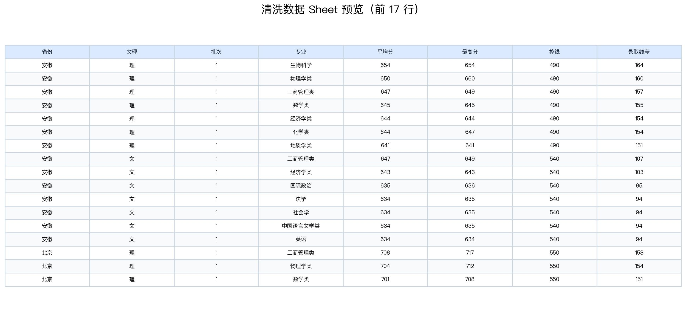
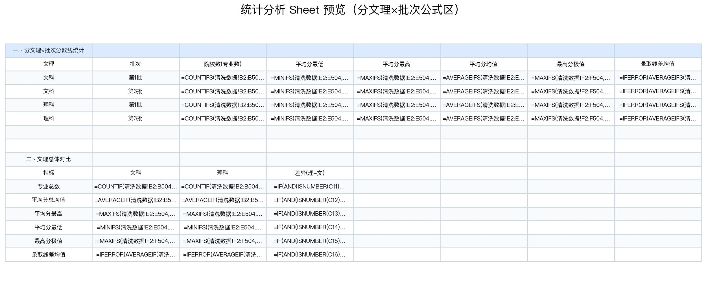
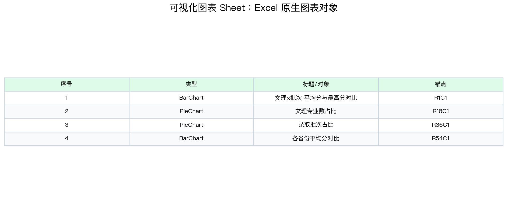

# PKU Admission Score Workbook Eval

> 日期：2026-06-23
> Run ID：`pku-admission-real-user-20260623-102936`
> Session：`cli:pku-admission-real-user-20260623-102936`
> 模型：`deepseek-v4-pro` via DashScope OpenAI-compatible
> 配置：`nanobot/configs/tableclaw-bailian-dashscope.json`
> 输入：`workspace/uploads/北京大学各省各专业录取情况.xlsx`

## 1. 评测目的

这条 run 用来评估 TableClaw 在“真实用户默认交互配置”下处理教育招生类复杂 workbook artifact 的能力。

和 Hermes run 不同，本次没有使用 `anthropic-xlsx-only` 专用配置，而是按默认交互配置启动，观察模型是否会自己选择合适的 spreadsheet skill 和工具链。为了保持通用任务 workspace 干净，启动时设置了 `TABLECLAW_SYNC_DOMAIN_PACK=0`，不把业务领域包同步进 `workspace/skills/` 和 `workspace/domain_knowledge/`。

核心观察点：

- 模型是否能识别这是复杂 Excel 清洗、公式统计和图表生成任务。
- 模型是否会自主读取通用 spreadsheet skill。
- 是否能识别合并单元格、重复表头、空列、表头污染、多级表头等脏结构。
- 是否能生成新的 workbook，保留原始表并新增清洗、统计和图表 sheet。
- 是否能在 workbook 中写入 Excel 动态公式和原生图表对象。
- 是否能记录 tool trace、token、耗时、产物和最终回复。

本次评测是 artifact smoke / workflow trace，不是自动打分 benchmark。

## 2. 用户任务

用户要求处理投档分数线 Excel：

1. 解读文件里分批次、分文理科、艺术类的原始投档数据结构。
2. 识别合并单元格、拆分乱行、空行、错位表头等脏数据。
3. 新建工作表清洗规整全量数据，保留原始数据，不覆盖源表。
4. 运用 `VLOOKUP`、`COUNTIFS`、`IF` 等 Excel 动态函数统计各批次文理分数线极值、均分、分段院校数。
5. 生成柱状图、饼图等 Excel 原生可视化图表，对比文理科与各批次分数差异。

完整 prompt：

- [prompt.txt](artifacts/pku-admission-real-user-20260623/logs/prompt.txt)

## 3. Skill / Tool 可见性设计

本次是默认真实用户配置：

```text
nanobot/configs/tableclaw-bailian-dashscope.json
```

启动命令中设置：

```text
TABLECLAW_SYNC_DOMAIN_PACK=0
```

含义：

- 默认 builtin skills 可见。
- workspace domain skill / domain knowledge 不重新同步。
- 模型根据任务自行选择 skill。

实际 trace 显示，模型第一步自主读取了 `anthropic-xlsx`：

```text
read …/skills/anthropic-xlsx/SKILL.md
tableclaw_inspect("…/workspace/uploads/北京大学各省各专业录取情况.xlsx")
```

## 4. 运行统计

Usage 记录：

```json
{
  "latency_ms": 530144,
  "model": "deepseek-v4-pro",
  "provider": "OpenAICompatProvider",
  "session_key": "cli:pku-admission-real-user-20260623-102936",
  "stop_reason": "completed",
  "tools_used": [
    "read_file",
    "tableclaw_inspect",
    "read_file",
    "read_file",
    "read_file",
    "exec",
    "exec",
    "exec",
    "exec",
    "write_file",
    "exec",
    "edit_file",
    "exec",
    "exec",
    "exec",
    "exec",
    "exec",
    "exec",
    "exec",
    "exec"
  ],
  "usage": {
    "cached_tokens": 476672,
    "completion_tokens": 29385,
    "prompt_tokens": 730040,
    "total_tokens": 759425
  }
}
```

汇总：

| 指标 | 值 |
| --- | ---: |
| 总耗时 | 530.1 秒 |
| 总 token | 759,425 |
| prompt tokens | 730,040 |
| completion tokens | 29,385 |
| cached tokens | 476,672 |
| 工具调用数 | 20 |
| 结束状态 | completed |

## 5. DeepSeek-V4-Pro 最终回复

最终面向用户的回复已从 session `cli:pku-admission-real-user-20260623-102936` 抽取并归档：

- [final_assistant_response.md](artifacts/pku-admission-real-user-20260623/logs/final_assistant_response.md)

最终回复核心结论：

- 使用 `anthropic-xlsx`。
- 调用 `tableclaw_inspect` 和多轮 `exec (python3 + openpyxl)`。
- 识别 7 类原始结构问题。
- 生成 5 个 sheet。
- 在 `统计分析` sheet 写入 `COUNTIFS`、`MINIFS`、`MAXIFS`、`AVERAGEIFS`、`IFERROR`、`VLOOKUP` 等公式。
- 在 `可视化图表` sheet 生成 4 张 Excel 原生图表。
- 输出文件保存到 `workspace/北京大学各省各专业录取情况_评测结果.xlsx`。

## 6. 工具轨迹

| 阶段 | 工具 / 动作 | 作用 |
| --- | --- | --- |
| 1 | `read_file` | 读取 `anthropic-xlsx/SKILL.md`，建立 Excel artifact 任务策略。 |
| 2 | `tableclaw_inspect` | 快速扫描原始 workbook：sheet、行列、合并单元格、预览文本。 |
| 3 | `read_file` | 读取 inspect 结果和 tool result。 |
| 4 | `exec (python/openpyxl)` | 深入分析 `Sheet1` 和 `Sheet2` 的表头、合并单元格、重复表头、特殊值。 |
| 5 | `write_file` | 写入处理脚本，避免长命令 heredoc 不稳定。 |
| 6 | `exec (python/openpyxl)` | 生成输出 workbook：原始数据、清洗数据、统计分析、可视化图表。 |
| 7 | `edit_file` + `exec` | 修正脚本，保留 Excel 公式而不是把公式覆盖成静态值。 |
| 8 | `exec (python/openpyxl)` | 验证 sheet、公式、图表对象和输出文件大小。 |
| 9 | `exec rm` | 删除临时脚本。 |

完整日志：

- [run_cli_output.txt](artifacts/pku-admission-real-user-20260623/logs/run_cli_output.txt)
- [session.jsonl](artifacts/pku-admission-real-user-20260623/logs/session.jsonl)
- [usage.jsonl](artifacts/pku-admission-real-user-20260623/logs/usage.jsonl)
- [workbook_summary.json](artifacts/pku-admission-real-user-20260623/logs/workbook_summary.json)
- [tool result 1](artifacts/pku-admission-real-user-20260623/tool-results/call_20b4e2a06b4440ff9fb7c8d4.txt)
- [tool result 2](artifacts/pku-admission-real-user-20260623/tool-results/call_9a426c33198b463b83612484.txt)
- [tool result 3](artifacts/pku-admission-real-user-20260623/tool-results/call_faf3e92d7f5b457d83b29e74.txt)

## 7. 关键中间判断

模型识别到的原始结构问题：

1. 数据从 B 列开始，A 列为空。
2. B 列存在多个 merged ranges，省份名只在分组首行出现。
3. 第 1 行为空白行，表头在第 2 行。
4. 第 170-171 行、第 346-347 行出现重复空行和重复表头。
5. 合并范围中出现“生源地”等表头文本污染数据。
6. G 列控线存在 `——` 特殊值，H 列录取线差对应为空。
7. `Sheet2` 是完全不同结构：第 1 行标题、第 2 行专业名、第 3 行最高分/最低分/平均分子列。

重要恢复点：

- 第一次输出后，模型意识到重算/覆盖逻辑会把公式变成静态值，于是重新生成 workbook，保留 Excel 公式。
- 用户要求 `VLOOKUP`，模型额外补充了 VLOOKUP 查询示例区域。
- 输出 workbook 保留了原始 sheet 复制件，没有覆盖源表。

## 8. 输出产物

### 8.1 输出 Workbook

文件：

- [北京大学各省各专业录取情况_评测结果.xlsx](artifacts/pku-admission-real-user-20260623/outputs/北京大学各省各专业录取情况_评测结果.xlsx)

输入源文件归档：

- [北京大学各省各专业录取情况.xlsx](artifacts/pku-admission-real-user-20260623/inputs/北京大学各省各专业录取情况.xlsx)

### 8.2 Workbook 结构

| Sheet | 行数 | 列数 | 非空单元格 | 公式数 | 图表数 | 合并单元格数 |
| --- | ---: | ---: | ---: | ---: | ---: | ---: |
| 原始数据 | 509 | 8 | 3,057 | 0 | 0 | 26 |
| 原始数据_理科专业 | 37 | 75 | 1,175 | 0 | 0 | 47 |
| 清洗数据 | 504 | 8 | 4,016 | 0 | 0 | 0 |
| 统计分析 | 111 | 8 | 438 | 308 | 0 | 5 |
| 可视化图表 | 1 | 1 | 0 | 0 | 4 | 0 |

### 8.3 预览图

清洗数据：



统计分析公式区：



Excel 图表对象：



## 9. 公式与图表核验

`统计分析` sheet 保留了 Excel 公式，而不是静态值。公式样例：

| Cell | Formula |
| --- | --- |
| `C3` | `=COUNTIFS(清洗数据!B2:B504,"文",清洗数据!C2:C504,1)` |
| `D3` | `=MINIFS(清洗数据!E2:E504,清洗数据!B2:B504,"文",清洗数据!C2:C504,1)` |
| `E3` | `=MAXIFS(清洗数据!E2:E504,清洗数据!B2:B504,"文",清洗数据!C2:C504,1)` |
| `F3` | `=AVERAGEIFS(清洗数据!E2:E504,清洗数据!B2:B504,"文",清洗数据!C2:C504,1)` |
| `H3` | `=IFERROR(AVERAGEIFS(清洗数据!H2:H504,清洗数据!B2:B504,"文",清洗数据!C2:C504,1),"无控线")` |

图表对象：

- `可视化图表` sheet 中有 4 个 openpyxl chart objects。
- 包含柱状图、饼图和横向柱状图。

限制：

- 当前本地未发现 LibreOffice / soffice，因此没有做 LibreOffice 公式重算和真实 Excel 渲染截图。
- openpyxl 能验证公式字符串、sheet 结构和 chart object 是否存在，但不能替代 Excel/WPS 打开后的视觉 QA。

## 10. 结果判断

本次 run 判定为：**主表 artifact 有条件通过，full workbook 覆盖不完整**。

### 10.1 完成度评分

这条任务没有独立 gold answer，因此不使用 ACC/F1，而是按“题目要求覆盖度 + 产物可验证性”做人工 rubric 评分。评分只基于本次 prompt、session trace、tool results 和输出 workbook。

综合评分：**72 / 100**。

补充口径：

- 如果只评价 `Sheet1` 主投档线表的清洗、统计和图表产物，完成度约 **84 / 100**。
- 如果严格评价“全量 workbook + 分批次/文理科/艺术类全覆盖”，完成度约 **65-70 / 100**。
- 对外展示时建议只引用这三个数字；下面的细分表用于解释扣分原因，不必在汇报页完整展开。

| 维度 | 权重 | 得分 | 依据 | 主要扣分 |
| --- | ---: | ---: | --- | --- |
| Skill / tool 路由 | 10 | 9 | 默认真实用户配置下，模型自主读取 `anthropic-xlsx`，并调用 `tableclaw_inspect` + openpyxl 脚本完成任务。 | 启动方式是管道输入，日志中有重复 prompt 回显；不影响结果，但不是理想交互轨迹。 |
| 原始结构理解 | 15 | 10 | 正确识别 `Sheet1` 主表、`Sheet2` 理科专业多级表，发现主表表头在第 2 行、B 列省份合并、批次编码在 `科类（录取批次）` 中。 | 源文件实际有 `Sheet3` 文科专业多级表和 `Sheet4` 报录比表，trace/产物未纳入完整结构解释。 |
| 脏数据识别 | 15 | 12 | 识别 A 列空列、合并单元格、重复表头、表头文本污染、`——` 特殊值、录取线差缺失等主表问题。 | 脏数据分析主要集中在 `Sheet1`，对 `Sheet2/3` 多级表头展开不足，对 `Sheet4` 未评估。 |
| 清洗规整与全量覆盖 | 20 | 11 | 生成 `清洗数据` sheet，将 `Sheet1` 503 行整理成 `省份/文理/批次/专业/平均分/最高分/控线/录取线差` 8 列结构。 | “全量数据”未严格满足：`Sheet3`、`Sheet4` 未复制/清洗；`Sheet2` 只原样保留为 `原始数据_理科专业`，没有转成长表。 |
| Excel 公式统计 | 20 | 16 | `统计分析` 有 308 个公式，覆盖 `COUNTIFS`、`MINIFS`、`MAXIFS`、`AVERAGEIFS`、`IFERROR`、`VLOOKUP`；公式引用范围覆盖 `清洗数据!2:504`。 | 未做 Excel/LibreOffice 重算；`VLOOKUP` 区域偏示例化，查询结果列没有单独填出结果；`IF` 主要以 `IFERROR` / 组合公式形式出现。 |
| 原生图表 | 10 | 8 | `可视化图表` sheet 有 4 个 openpyxl chart objects，系列范围绑定到 `统计分析`，包括柱状图、饼图、横向柱状图。 | 只验证到对象和数据源范围，未做 Excel/WPS 打开后的视觉渲染检查；图表是否美观、标签是否可读未验证。 |
| 结果验证与可追溯性 | 10 | 6 | 归档了 prompt、session、usage、tool-results、最终回复、workbook summary 和预览图；模型还自我修正了“公式被覆盖为静态值”的问题。 | 没有 headless open/recalc、公式错误扫描、chart render、coverage manifest；token 和耗时偏高。 |

结论：这条 run 已经证明 TableClaw 能在默认真实用户配置下完成一条“主投档表 -> 清洗数据 -> 公式统计 -> 原生图表”的 workbook artifact 流程；但不能宣称完成了“整份 Excel 全量数据”的严格处理，也不能宣称艺术类维度被完整建模。

### 10.2 结果分析

可靠完成的部分：

- **默认真实用户配置下，模型能自主路由到 spreadsheet skill。** 本次没有使用 `anthropic-xlsx-only` 配置，模型仍第一步读取 `anthropic-xlsx`，并配合 `tableclaw_inspect` 与 openpyxl 脚本完成处理，说明通用 skill 的触发路径是有效的。
- **`Sheet1` 主表的脏结构识别较充分。** 模型识别到 A 列空列、B 列省份合并单元格、第一行空行、重复表头、表头文本污染、`——` 特殊值、录取线差缺失等问题，并在 `清洗数据` sheet 中把 503 行数据规范为 8 列结构化表。
- **产物具备用户要求的核心形态。** 输出 workbook 保留原始数据，新增 `清洗数据`、`统计分析`、`可视化图表`；`统计分析` 中有 308 个公式，覆盖 `COUNTIFS`、`MINIFS`、`MAXIFS`、`AVERAGEIFS`、`IFERROR`、`VLOOKUP`；`可视化图表` 中有 4 个 Excel 原生 chart object。
- **模型在过程中自我修正了一个关键 artifact 错误。** 初始脚本曾把公式重算结果覆盖成静态值，模型意识到这违背用户“运用 Excel 动态函数”的要求后重新生成 workbook，保留公式。这说明 trace 中存在有效的质量反思。
- **可追溯证据完整。** 本次归档包含 prompt、session、usage、tool-results、最终回复、输出 workbook、workbook summary 和预览图，足以复盘 skill 选择和工具调用。

主要边界：

- **没有覆盖完整 workbook。** 源文件实际包含 `Sheet1`、`Sheet2`、`Sheet3`、`Sheet4`。本次输出只保留/处理了 `Sheet1` 和 `Sheet2`：`Sheet3` 是文科专业多级表，`Sheet4` 是报录比类表。若按用户“全量数据”严格理解，这条 run 只完成了主投档表与理科专业表的 artifact，不是全 workbook 清洗。
- **“艺术类”没有形成独立结构。** 源 `Sheet1` 中可见“艺术学理论类”等专业名，但并没有被解析成独立的艺术类批次/类别维度。最终统计主要围绕文/理和批次展开，因此满足“文理和批次”较好，满足“艺术类”不足。
- **公式存在性已验证，公式计算结果未验证。** openpyxl 可以确认 308 个公式字符串和 chart object 存在，但本地没有 LibreOffice / WPS / Excel headless 环境，未做重算、公式错误扫描或真实打开后的图表可见性检查。
- **图表是对象级通过，不是视觉级通过。** 当前只能确认 workbook 中有 4 个 chart objects；图表标题、系列范围、配色、标签是否在 Excel 中完全可读，还需要 render/人工打开校验。
- **成本仍然偏高。** 本次耗时约 530 秒、759,425 tokens。对一次复杂 artifact smoke 可以接受，但如果教育表格任务批量化，需要显著降低 inspect 和脚本探索成本。

## 11. 后续改进

基于这条 trace，下一轮应优先补以下能力：

- **Workbook coverage checker。** 在执行前先列出所有 sheet 的用途、维度、表头层级和是否纳入处理；最终产物必须给出 `included / excluded / reason` 清单。像本次 `Sheet3`、`Sheet4` 没进入输出，应在报告中显式说明原因，而不是隐式遗漏。
- **Category normalization。** 对招生类表格建立通用类别解析：文科、理科、艺术、体育、综合改革、本科批/一批/三批、专业组等。若源表没有独立艺术类字段，但专业名含“艺术”，应至少生成“疑似艺术相关专业”标记，而不是只按文理统计。
- **Formula preservation checker。** 自动抽查关键统计区，确认公式不是静态值；同时检查公式中引用范围覆盖清洗数据全量行数，避免 off-by-one 或只引用部分数据。
- **Chart binding checker。** 自动读取 chart series 的数据源范围，确认柱状图/饼图绑定到 `统计分析` 或图表数据区，而不是空白范围；有 render 环境时再做截图级视觉检查。
- **Headless recalc / open check。** 引入 LibreOffice/WPS/Excel 打开、重算、保存和错误扫描。没有该环境时，报告必须标注“公式结构通过，计算结果未验证”。
- **教育招生类小评测集。** 至少补 5-10 个真实 workbook，覆盖投档线、专业分数线、分省分专业表、一分一段、艺术/体育类、综合改革省份等结构，避免用单个北大样本推断通用能力。
- **低 token 执行路径。** 对这类 workbook 先用 schema summary 和 sheet coverage plan 固化处理范围，再写脚本执行；减少反复读取长 tool result 和在对话中解释大段结构。
